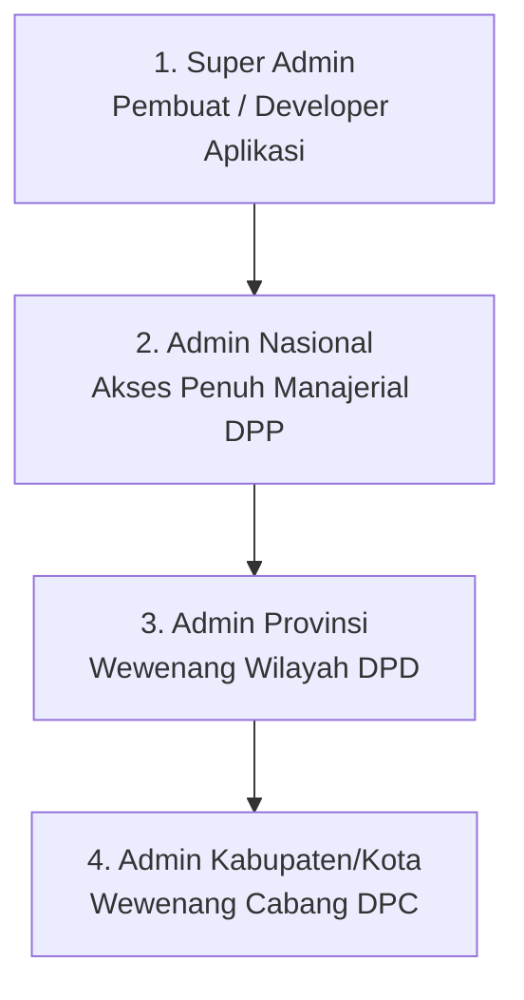
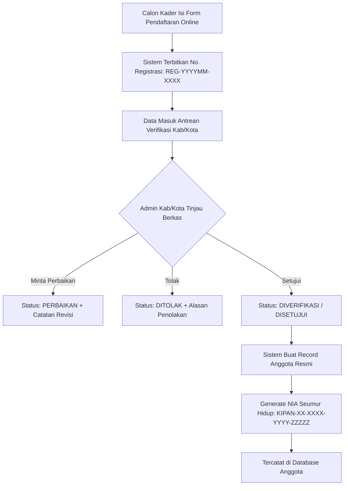
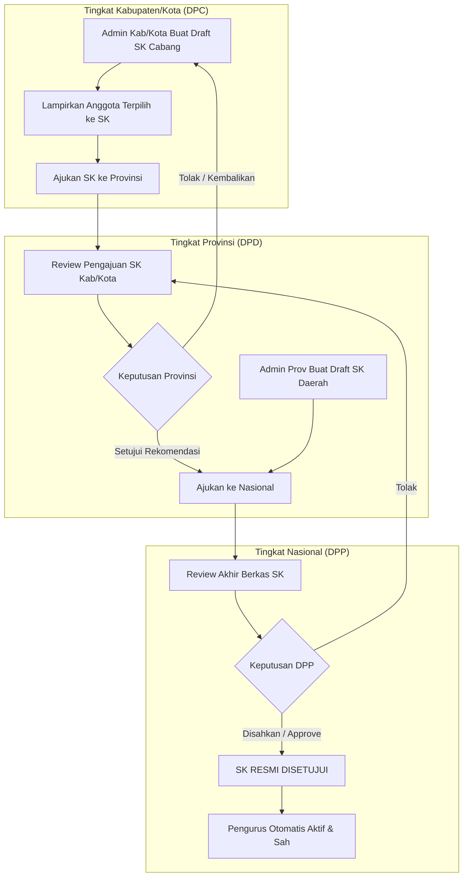
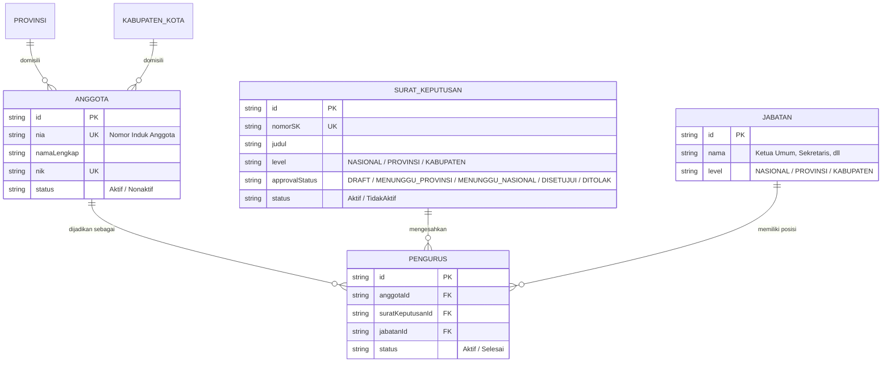

# PRODUCT REQUIREMENT DOCUMENT (PRD)
## SIM-KIPAN: Sistem Informasi Manajemen Keanggotaan, Kepengurusan, & SK Terpadu

---

## 1. INFORMASI DOKUMEN & IKHTISAR SISTEM

| Parameter | Detail |
| :--- | :--- |
| **Nama Produk** | **SIM-KIPAN** (*System Information Management* - Kader Inti Pemuda Anti Narkoba) |
| **Organisasi** | **Dewan Pimpinan Pusat (DPP) KIPAN Indonesia** |
| **Kemitraan Strategis** | Kementerian Pemuda dan Olahraga (Kemenpora RI) & Badan Narkotika Nasional (BNN RI) |
| **Versi Dokumen** | **3.0.0 (Comprehensive Architecture & Workflow)** |
| **Status** | *Approved & Active Development* |
| **Teknologi Stack** | Next.js 16 (App Router), React 19, TypeScript, Tailwind CSS v4, Prisma ORM v6, MySQL Database |

### Ringkasan Eksekutif
SIM-KIPAN adalah platform digital komprehensif yang memadukan **Company Profile Publik** resmi dengan **Sistem Informasi Manajemen Keanggotaan & Legalitas Kepengurusan Bertingkat (SIM/CMS)**.

Platform ini menyelesaikan tantangan desentralisasi organisasi KIPAN yang tersebar di 38 Provinsi dan 514 Kabupaten/Kota di Indonesia dengan menerapkan:
1. **Integrasi Data Relasional Anggota & Pengurus:** Data pengurus dan anggota saling berelasi di database, namun disajikan dalam antarmuka (UI) admin yang terpisah secara tegas.
2. **Birokrasi & Validasi SK Berjenjang:** Mekanisme pengajuan dan approval Surat Keputusan (SK) dari tingkat Kabupaten/Kota ke Provinsi hingga disahkan secara terpusat oleh Nasional.
3. **Role-Based Access Control (RBAC):** Pembagian 4 tingkatan wewenang administrator dengan tampilan UI yang terisolasi dan spesifik sesuai hak yurisdiksinya.

---

## 2. STRUKTUR PERAN & WEWENANG PENGGUNA (RBAC)

Sistem membagi akses administrator ke dalam 4 (empat) peran hierarkis:

### Matriks Wewenang & Hak Akses (Permission Matrix)

| Fitur / Modul | Super Admin | Admin Nasional | Admin Provinsi | Admin Kab/Kota |
| :--- | :---: | :---: | :---: | :---: |
| **Cakupan Akses** | Seluruh Sistem | Nasional, Prov, Kab | Wilayah Provinsi | Wilayah Kab/Kota |
| **Verifikasi Pendaftaran Anggota** | ✅ | ✅ (Bypass) | ❌ | ✅ (Utama) |
| **Manajemen Data Anggota** | ✅ Full | ✅ Full | ✅ Lihat & Kelola | ✅ Lihat & Kelola |
| **Draft SK Tingkat Kab/Kota** | ✅ | ✅ | ❌ | ✅ (Input SK Cabang) |
| **Draft SK Tingkat Provinsi** | ✅ | ✅ | ✅ (Input SK Daerah) | ❌ |
| **Draft SK Tingkat Nasional** | ✅ | ✅ (Input SK Pusat) | ❌ | ❌ |
| **Approval SK Kab/Kota (Tahap 1)**| ✅ | ❌ | ✅ (Wewenang Provinsi) | ❌ |
| **Approval SK Final (Nasional)** | ✅ | ✅ (Pengesahan Akhir)| ❌ | ❌ |
| **Manajemen Pengurus** | ✅ Full | ✅ Full | ✅ Di SK Prov/Kab | ✅ Di SK Kab/Kota |
| **Master Jabatan** | ✅ Full | ✅ Full | ❌ (Hanya Lihat) | ❌ (Hanya Lihat) |
| **Master Wilayah** | ✅ Full | ✅ Full | ❌ | ❌ |
| **CMS Berita, Galeri, Program** | ✅ Full | ✅ Full | ❌ | ❌ |
| **Manajemen Akun / Pengguna** | ✅ Full | ❌ | ❌ | ❌ |

---

## 3. ALUR BISNIS UTAMA (CORE BUSINESS WORKFLOW)

### 3.1. Alur Pendaftaran & Verifikasi Anggota
Calon kader mendaftar secara mandiri melalui form online publik dan diverifikasi oleh admin tingkat Kabupaten/Kota.

*Prinsip Utama:*
- Calon yang disetujui **HANYA** berstatus sebagai **Anggota Biasa**.
- Pendaftaran online **TIDAK PERNAH** langsung menjadikan seseorang sebagai Pengurus atau memberi jabatan.

---

### 3.2. Alur Pengajuan, Hierarki Verifikasi, & Approval Surat Keputusan (SK)
Surat Keputusan (SK) adalah instrumen legalitas pembentukan kepengurusan. Alur approval berjenjang menjamin tertib administrasi:

#### State Machine Status Approval SK
1. `DRAFT`: SK baru dibuat dan masih dalam penyusunan berkas/personel.
2. `MENUNGGU_PROVINSI`: Khusus SK tingkat Kabupaten/Kota yang telah diajukan ke DPD Provinsi.
3. `MENUNGGU_NASIONAL`: SK tingkat Provinsi atau SK Kab/Kota yang telah disetujui DPD Provinsi, menunggu pengesahan DPP.
4. `DISETUJUI`: SK resmi disahkan DPP Nasional. Pengurus di dalamnya resmi aktif.
5. `DITOLAK`: SK ditolak dengan alasan catatan perbaikan.

---

### 3.3. Relasi Data & Pemisahan Antarmuka (Anggota vs Pengurus)

> [!IMPORTANT]
> **Aturan Bisnis Kunci:**
> Data Pengurus dan Anggota **terintegrasi dan berelasi di database**, namun **tampilan di Admin Panel wajib terpisah**.

#### Kebijakan Tampilan (UI Policy):
1. **Menu "Data Anggota":** Menampilkan seluruh anggota KIPAN yang terverifikasi. Tidak menampilkan detail birokrasi SK.
2. **Menu "Data Pengurus":** Hanya menampilkan anggota yang terhubung ke SK aktif yang berstatus `approvalStatus = DISETUJUI`. Anggota pada SK yang berstatus Draft/Menunggu Approval belum diakui sebagai pengurus aktif.
3. **Menu "Surat Keputusan (SK)":** Tempat menyusun lembar SK, melampirkan personel (dipilih dari daftar Anggota), menetapkan Jabatan, serta memproses tombol Pengajuan/Approval.

---

## 4. SPESIFIKASI MODUL & ANTARMUKA ADMIN (UI SPECIFICATIONS)

### 4.1. Sidebar Dinamis Berbasis Role
Sidebar admin menyaring daftar menu secara otomatis berdasarkan peran (`role`) pengguna yang login:

| Menu Sidebar | Super Admin | Admin Nasional | Admin Provinsi | Admin Kab/Kota |
| :--- | :---: | :---: | :---: | :---: |
| **Dashboard** | ✅ | ✅ | ✅ | ✅ |
| **Wilayah** | ✅ | ✅ | ❌ | ❌ |
| **Data Anggota** | ✅ | ✅ | ✅ | ✅ |
| **Data Pengurus** | ✅ | ✅ | ✅ | ✅ |
| **Surat Keputusan (SK)** | ✅ | ✅ | ✅ | ✅ |
| **Manajemen Jabatan** | ✅ | ✅ | ❌ | ❌ |
| **Pendaftaran Baru (Input)** | ✅ | ✅ | ❌ | ✅ |
| **Verifikasi Pendaftaran** | ✅ | ✅ | ❌ | ✅ |
| **CMS Berita & Publikasi** | ✅ | ✅ | ❌ | ❌ |
| **CMS Galeri Kegiatan** | ✅ | ✅ | ❌ | ❌ |
| **CMS Program Kerja** | ✅ | ✅ | ❌ | ❌ |
| **Statistik & Analitik** | ✅ | ✅ | ✅ | ✅ |
| **Laporan & Cetak PDF** | ✅ | ✅ | ✅ | ✅ |
| **Manajemen Role & User** | ✅ | ❌ | ❌ | ❌ |
| **Pengaturan Akun** | ✅ | ✅ | ✅ | ✅ |

### 4.2. Header & User Identity
- **Display Name Sesuai Role:** Menampilkan identitas formal pengguna di pojok kanan atas:
  - `Super Admin` (Badge: SUPER)
  - `Admin Nasional` (Badge: NASIONAL)
  - `Admin Provinsi` (Badge: PROVINSI)
  - `Admin Kabupaten/Kota` (Badge: KABUPATEN)
- **Status Koneksi & Wilayah:** Menampilkan keterangan yurisdiksi kerja pengguna secara transparan.

---

## 5. SKENARIO PENGUJIAN & VALIDASI SISTEM (ACCEPTANCE CRITERIA)

### 5.1. Pendaftaran & Verifikasi
- [x] Pendaftar mengisi form 5 langkah dengan validasi NIK 16 digit dan unggah berkas.
- [x] Sistem menerbitkan nomor registrasi `REG-YYYYMM-XXXX`.
- [x] Admin Kab/Kota melihat antrean pendaftar di wilayahnya.
- [x] Tindakan "Setujui" membuat record Anggota dan menerbitkan NIA format `KIPAN-XX-XXXX-YYYY-ZZZZZ`.

### 5.2. Pembuatan & Hierarki Approval SK
- [x] Admin Kab/Kota membuat draft SK cabang dan menambahkan anggota dari database.
- [x] Admin Kab/Kota klik "Ajukan ke Provinsi" (`status -> MENUNGGU_PROVINSI`). Tombol approve dinonaktifkan untuk Kab/Kota.
- [x] Admin Provinsi login, melihat SK Kab/Kota, meninjau berkas, lalu klik "Setujui Rekomendasi & Teruskan ke Nasional" (`status -> MENUNGGU_NASIONAL`).
- [x] Admin Nasional login, melihat berkas SK, lalu klik "Sahkan & Setujui SK" (`status -> DISETUJUI`).
- [x] Seluruh personil di SK tersebut otomatis resmi berstatus sebagai `Pengurus Aktif` dan tampil di halaman `Data Pengurus` serta statistik dashboard.

### 5.3. Isolasi Keamanan Tampilan (RBAC)
- [x] User dengan role Kab/Kota tidak dapat melihat atau mengakses menu CMS Publikasi dan Manajemen Akun.
- [x] User dengan role Provinsi tidak dapat memvalidasi pendaftaran anggota lokal (khusus wewenang Kab/Kota).
- [x] Manipulasi URL atau state halaman terproteksi otomatis mengalihkan pengguna kembali ke halaman Dashboard dengan status `Akses Ditolak`.

---

## 6. ROADMAP & PENGEMBANGAN LANJUTAN
1. **Penerbitan KTA Digital Berbasis QR Code:** Anggota dan Pengurus aktif dapat mengunduh kartu tanda anggota digital terverifikasi.
2. **Notifikasi WhatsApp Gateway Terotomasi:** Mengirimkan pesan WhatsApp otomatis saat status pendaftaran berubah atau saat SK disahkan.
3. **Multi-File SK Digital Signature:** Integrasi tanda tangan digital tersertifikasi untuk lembar Surat Keputusan.
