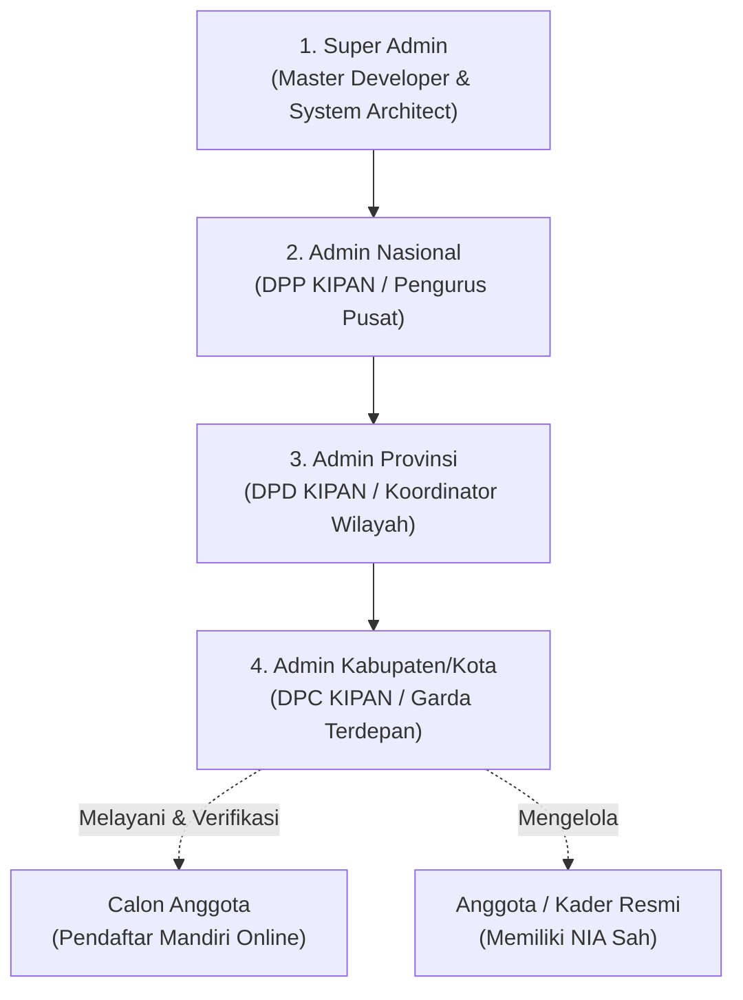
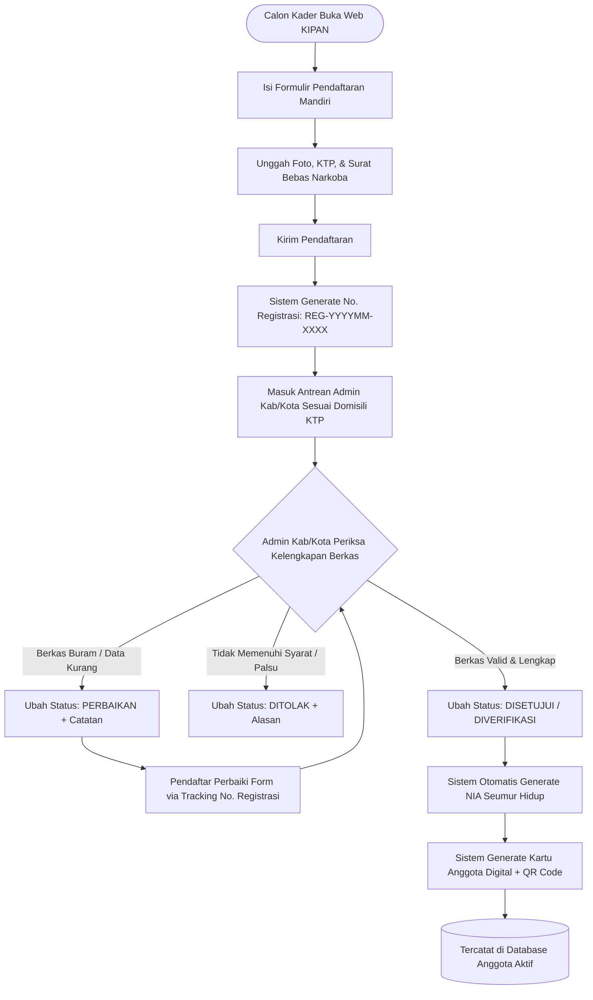
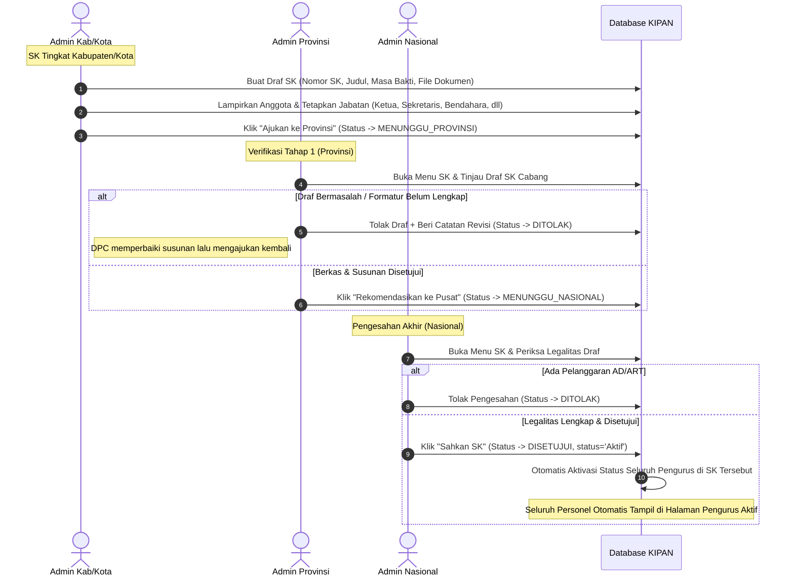

# PRODUCT REQUIREMENT DOCUMENT (PRD)
## SIM-KIPAN: Sistem Informasi Manajemen Keanggotaan, Kepengurusan, & CMS Publikasi Terpadu

---

## 1. INFORMASI DOKUMEN & IKHTISAR SISTEM

| Parameter | Detail |
| :--- | :--- |
| **Nama Produk** | **SIM-KIPAN** (*System Information Management* - Kader Inti Pemuda Anti Narkoba) |
| **Organisasi Pengembang & Pemilik** | **Dewan Pimpinan Pusat (DPP) KIPAN Indonesia** |
| **Kemitraan Strategis** | Kementerian Pemuda dan Olahraga (Kemenpora RI) & Badan Narkotika Nasional (BNN RI) |
| **Versi Dokumen** | **4.0.0 (Comprehensive Roles, Business Flows & Lifecycle Architecture)** |
| **Status Dokumen** | *Approved & Active Implementation* |
| **Teknologi Utama** | Next.js 16 (App Router), React 19, TypeScript, Tailwind CSS v4, Prisma ORM v6, MySQL Database |

---

### 1.1. Latar Belakang & Visi Produk
Kader Inti Pemuda Anti Narkoba (KIPAN) merupakan program strategis nasional kepemudaan yang tersebar di 38 Provinsi dan 514 Kabupaten/Kota di seluruh Republik Indonesia. Sebelum adanya sistem ini, pengelolaan organisasi menghadapi kendala:
1. **Fragmentasi Data Kader:** Data anggota tersebar di berbagai cabang secara manual (spreadsheet/kertas) tanpa standardisasi Nomor Induk Anggota (NIA) tunggal.
2. **Ketiadaan Jejak Legalitas SK Kepengurusan:** Sulitnya memvalidasi keabsahan struktur pengurus daerah secara real-time dan berjenjang dari DPC (Kabupaten/Kota), DPD (Provinsi), hingga DPP (Nasional).
3. **Ketiadaan Saluran Publikasi Berjenjang:** Cabang daerah tidak memiliki media resmi untuk mempublikasikan kegiatan lokal secara terverifikasi, sementara portal nasional rawan dibanjiri konten lokal yang tidak relevan bagi audiens umum.

**SIM-KIPAN** hadir sebagai platform terpadu yang memadukan **Company Profile Publik (Landing Page)** dengan **Sistem Informasi Manajemen Keanggotaan, Kepengurusan, dan Publikasi Berjenjang (CMS/SIM)** yang aman, akuntabel, dan transparan.

---

## 2. STRUKTUR PERAN & WEWENANG PENGGUNA (ROLE-BASED ACCESS CONTROL)

Sistem membagi pengguna ke dalam 4 (empat) level Administrator dan 2 (dua) tipe Pengguna Eksternal:



---

### 2.1. Matriks Granular Hak Akses (RBAC Matrix)

| Modul / Fitur Sistem | Super Admin | Admin Nasional | Admin Provinsi | Admin Kab/Kota | Anggota / Publik |
| :--- | :---: | :---: | :---: | :---: | :---: |
| **Jangkauan Yurisdiksi Data** | Seluruh Sistem | Nasional (Seluruh Indonesia) | Provinsi Terkait Saja | Kab/Kota Terkait Saja | Pribadi / Publik |
| **Verifikasi Pendaftaran Baru** | Full Override | Full Override | ❌ Tidak Berwenang | ✅ **Verifikator Utama** | Form Registrasi |
| **Manajemen Data Anggota** | Full CRUD | Full CRUD (Nasional) | Read-Only (Provinsi) | Read & Kelola (Kab/Kota) | Profil Sendiri |
| **Drafting SK Kepengurusan** | Semua Level | Level Nasional & Prov | Level Provinsi | Level Kabupaten/Kota | ❌ |
| **Review SK (Tahap 1 Provinsi)** | ✅ | ❌ | ✅ **Reviewer Resmi** | ❌ | ❌ |
| **Pengesahan Akhir SK (Approval)** | ✅ Override | ✅ **Pengesahan Sah** | ❌ | ❌ | ❌ |
| **Manajemen Pengurus** | Full CRUD | Full CRUD | Di SK Prov & Kab Terkait | Di SK Kab/Kota Terkait | Cek Struktur Publik |
| **Master Data Wilayah** | Full CRUD | Full CRUD | ❌ Read Only | ❌ Read Only | Read Only |
| **Master Data Jabatan** | Full CRUD | Full CRUD | ❌ Read Only | ❌ Read Only | Read Only |
| **Publikasi Berita UMUM** | ✅ Boleh | ✅ **Hak Eksklusif** | ❌ **Dilarang Keras** | ❌ **Dilarang Keras** | Konsumsi Publik |
| **Publikasi Berita INTERNAL** | Semua Tingkat | Tingkat Nasional | Khusus Provinsinya | Khusus Kab/Kotanya | Baca Berita |
| **Upload Galeri & Program Kerja**| Full CRUD | Full CRUD | Galeri Provinsinya | Galeri Kab/Kotanya | Lihat Galeri |
| **Ekspor Laporan & Statistik** | Full Laporan | Laporan Nasional | Laporan Provinsi | Laporan Kabupaten/Kota | ❌ |
| **Manajemen User Administrator** | ✅ Full CRUD | ❌ Dibatasi | ❌ | ❌ | ❌ |
| **Audit Activity Log & Backup DB** | ✅ Full | ❌ | ❌ | ❌ | ❌ |

---

## 3. ATURAN HAK, WEWENANG, SERTA DO'S & DON'TS SETIAP LEVEL ADMIN

Untuk menjamin kedaulatan data dan kepatuhan terhadap AD/ART Organisasi, setiap tingkatan administrator diatur secara ketat dengan aturan "Boleh & Tidak Boleh":

---

### 3.1. Super Admin (Administrator Sistem & Developer)
*Fokus Utama: Stabilitas infrastruktur, pemeliharaan arsitektur, manajemen akun admin tingkat tinggi, dan penanganan bug.*

* **APA YANG BOLEH DILAKUKAN (DO'S):**
  1. Melakukan bypass darurat dan koreksi struktur data jika terjadi inkonsistensi teknis di database.
  2. Menambah, mengedit, menonaktifkan, atau mereset akun administrator di seluruh level (Nasional, Provinsi, Kabupaten/Kota).
  3. Mengonfigurasi variabel sistem global, integrasi API, database backup/restore, dan profil identitas organisasi KIPAN.
  4. Memantau *Activity Log* untuk mendeteksi kecurangan atau anomali audit transaksi data.
* **APA YANG TIDAK BOLEH DILAKUKAN (DON'TS):**
  1. Dilarang menghapus data keanggotaan atau SK resmi yang sah secara permanen (*hard delete*) tanpa persetujuan tertulis DPP KIPAN.
  2. Dilarang mengubah substansi Surat Keputusan yang telah ditandatangani secara sah di dunia nyata.

---

### 3.2. Admin Nasional (Dewan Pimpinan Pusat - DPP KIPAN)
*Fokus Utama: Otoritas tertinggi legalitas kepengurusan, penetapan standar kaderisasi nasional, dan penyiaran informasi resmi kepada publik Indonesia.*

* **APA YANG BOLEH DILAKUKAN (DO'S):**
  1. **Pengesahan Akhir SK (Final Approval):** Mengesahkan atau menolak draf SK kepengurusan dari seluruh tingkatan (Nasional, DPD Provinsi, maupun DPC Kabupaten/Kota yang telah direkomendasikan provinsi).
  2. **Rilis Berita UMUM (Eksklusif):** Menulis, menyunting, dan mempublikasikan Berita Umum berskala nasional yang tampil langsung di halaman utama (*Landing Page*) publik.
  3. **Rilis Berita Internal Nasional:** Menerbitkan informasi internal konsolidasi organisasi tingkat pusat.
  4. **Tata Kelola Master Data:** Menambah dan mengelola referensi resmi `Master Wilayah` dan `Master Jabatan` agar seragam di seluruh Indonesia.
  5. **Akses Data Agregat Nasional:** Melihat, menyaring, dan mengekspor seluruh basis data anggota dan pengurus dari Sabang sampai Merauke.
* **APA YANG TIDAK BOLEH DILAKUKAN (DON'TS):**
  1. Dilarang memanipulasi draf susunan kepengurusan lokal cabang tanpa konfirmasi dari DPD/DPC terkait.
  2. Dilarang menyetujui SK yang tidak melampirkan berkas dokumen fisik/digital SK yang sah.
  3. Dilarang membuat akun pengguna setingkat Super Admin.

---

### 3.3. Admin Provinsi (Dewan Pimpinan Daerah - DPD KIPAN)
*Fokus Utama: Koordinasi wilayah provinsi, pengawasan DPC kab/kota, penyusunan draf SK DPD, dan kurasi berita daerah.*

* **APA YANG BOLEH DILAKUKAN (DO'S):**
  1. **Drafting SK Provinsi:** Menyusun draf kepengurusan DPD Provinsi sendiri, melampirkan anggota resmi dari wilayah provinsinya, dan mengajukannya ke Admin Nasional.
  2. **Reviewer & Rekomendasi SK Kab/Kota (Tahap 1):** Memeriksa draf SK yang diajukan oleh DPC Kabupaten/Kota di wilayah naungannya. Berwenang menyetujui rekomendasi untuk diteruskan ke Nasional (`MENUNGGU_NASIONAL`) atau mengembalikannya dengan catatan penolakan (`DITOLAK`).
  3. **Rilis Berita Internal Provinsi:** Mempublikasikan berita internal yang secara otomatis terkunci untuk kategori `Provinsi` dan hanya terasosiasi dengan provinsinya sendiri.
  4. **Monitoring Anggota Daerah:** Memantau statistik dan daftar kader aktif di seluruh kabupaten/kota dalam naungan provinsinya.
* **APA YANG TIDAK BOLEH DILAKUKAN (DON'TS):**
  1. **Dilarang Keras mengunggah "Berita Umum"** (UI dan API wajib menolak/mengunci opsi ini).
  2. **Dilarang mengunggah berita atas nama provinsi lain** atau mengubah data wilayah di luar yurisdiksinya.
  3. **Dilarang melakukan pengesahan akhir SK secara mandiri** (SK hanya sah apabila telah disetujui Admin Nasional).
  4. **Dilarang memverifikasi calon anggota baru** (verifikasi berkas fisik pendaftaran adalah wewenang mutlak DPC Kabupaten/Kota).

---

### 3.4. Admin Kabupaten/Kota (Dewan Pimpinan Cabang - DPC KIPAN)
*Fokus Utama: Garda terdepan kaderisasi, verifikasi faktual pendaftar, penyusunan draf SK Cabang, dan pelaporan kegiatan cabang.*

* **APA YANG BOLEH DILAKUKAN (DO'S):**
  1. **Verifikasi Calon Anggota (Otoritas Utama):** Memeriksa berkas pendaftaran calon kader di wilayahnya (NIK, KTP, Surat Pernyataan Bebas Narkoba, Pakta Integritas). Berwenang Menyetujui, Menolak, atau Meminta Perbaikan data.
  2. **Penerbitan NIA:** Menyetujui pendaftaran yang secara otomatis memicu pembentukan profil Anggota dan penerbitan Nomor Induk Anggota (NIA) resmi.
  3. **Drafting SK Cabang:** Menyusun draf SK kepengurusan DPC tingkat kabupaten/kota dengan memilih anggota aktif ber-NIA, menentukan jabatan yang valid, dan mengajukannya ke tingkat Provinsi (`MENUNGGU_PROVINSI`).
  4. **Rilis Berita Internal Kabupaten/Kota:** Mengunggah berita kegiatan cabang lokal yang secara otomatis terkunci pada kategori `Kabupaten` dan wilayah kabupaten/kotanya sendiri.
* **APA YANG TIDAK BOLEH DILAKUKAN (DON'TS):**
  1. **Dilarang Keras memilih atau mengunggah "Berita Umum"** (hanya boleh Berita Internal Cabang).
  2. **Dilarang mengunggah berita untuk kabupaten/kota lain.**
  3. **Dilarang langsung mengesahkan SK Kepengurusan** (wajib melalui jalur pengajuan ke Provinsi dan Nasional).
  4. **Dilarang mengangkat pengurus tanpa memilih jabatan resmi** yang ada pada Master Jabatan.
  5. **Dilarang mengangkat seseorang menjadi pengurus jika orang tersebut belum terdaftar sebagai anggota resmi** (wajib memiliki NIA terlebih dahulu).

---

## 4. ARSITEKTUR ALUR BISNIS END-TO-END (CORE BUSINESS WORKFLOWS)

---

### 4.1. Alur Pendaftaran & Verifikasi Kaderisasi (Penerbitan NIA & KTA)



*Aturan Bisnis Pendaftaran:*
- 1 (satu) NIK KTP hanya boleh terdaftar 1 (satu) kali di seluruh database nasional.
- Pendaftar yang disetujui **berstatus sebagai Anggota Biasa (Relawan)**, bukan Pengurus.
- Format Nomor Induk Anggota (NIA): `KIPAN-[KODE_PROV]-[KODE_KAB]-[TAHUN]-[NO_URUT]` (Contoh: `KIPAN-JBR-3217-2026-00045`).

---

### 4.2. Alur Birokrasi & Pengesahan Surat Keputusan (SK) Kepengurusan



---

### 4.3. Alur Publikasi CMS Berita & Konten dengan Boundary Wilayah

```mermaid
flowchart TD
    User([Admin Login]) --> Detect{Deteksi Role & Wilayah Pengguna}
    
    Detect -->|Admin Kab/Kota| LockKab[Kategori Otomatis: KABUPATEN<br/>Jenis: INTERNAL Saja<br/>Wilayah: Terkunci pada Kab/Kotanya]
    Detect -->|Admin Provinsi| LockProv[Kategori Otomatis: PROVINSI<br/>Jenis: INTERNAL Saja<br/>Wilayah: Terkunci pada Provinsinya]
    Detect -->|Admin Nasional| FreeNas[Bebas Memilih:<br/>1. Berita UMUM (Tampil di Beranda Publik)<br/>2. Berita INTERNAL (Konsolidasi Pusat)]

    LockKab --> Input[Tulis Judul, Konten, & Upload Gambar Thumbnail]
    LockProv --> Input
    FreeNas --> Input

    Input --> UploadAPI[API /api/upload: Simpan File ke /public/uploads/]
    UploadAPI --> SaveDB[(Simpan ke Database Berita)]
    SaveDB --> OutputPublik{Penyajian di Frontend Landing Page}
    
    OutputPublik -->|Jika Jenis = UMUM| PortalHome[Halaman Utama / Landing Page KIPAN]
    OutputPublik -->|Jika Jenis = INTERNAL| PortalInternal[Halaman Arsip Berita Wilayah]
```

---

## 5. MANAJEMEN SIKLUS HIDUP KADER (LIFECYCLE & EDGE CASES)

Dalam dinamika organisasi kepemudaan, sering terjadi perpindahan posisi, pergantian kepengurusan periodik, dan mutasi. Sistem dirancang untuk menangani skenario-skenario tersebut secara elegan:

---

### 5.1. Skenario Promosi Jabatan (Lintas Tingkat)
> **Contoh Kasus Nyata:** Seorang kader bernama *Mirwan Kholid* telah selesai menjabat sebagai Ketua DPC KIPAN Kabupaten Bandung Barat (status: Demisioner). Kemudian, dalam Musda DPD KIPAN Jawa Barat, beliau terpilih menjadi Pengurus Provinsi, atau bahkan terpilih menjadi jajaran DPP KIPAN Nasional.

* **Kebijakan & Solusi Sistem:**
  1. **Anggota Tetap Satu (Single Source of Truth):** Data fisik dan personal (*Anggota*) tidak boleh diduplikasi. Record anggota tetap menggunakan NIA yang sama.
  2. **Riwayat Jabatan Multipel (One-to-Many Pengurus):** Entitas `Anggota` memiliki relasi `1 : N` dengan entitas `Pengurus`.
  3. **Pencatatan Promosi:**
     - Pada SK lama (SK DPC Kab. Bandung Barat), status beliau ditandai sebagai `Demisioner` atau `Selesai` dengan tanggal berakhir masa jabatan.
     - Pada SK baru (SK DPD Jawa Barat atau SK DPP Nasional), admin penyusun SK baru dapat mencari nama beliau di database `Anggota` (walaupun beliau berstatus Demisioner di kepengurusan sebelumnya).
     - Saat SK baru disahkan, dibuat record baru di tabel `Pengurus` dengan level baru dan jabatan baru.
  4. **Portofolio Historis:** Profil anggota akan menampilkan rekam jejak pengabdian secara kronologis:
     - *2022 - 2024:* Ketua DPC KIPAN Kabupaten Bandung Barat (Demisioner).
     - *2024 - Sekarang:* Wakil Ketua DPD KIPAN Jawa Barat (Aktif).

---

### 5.2. Skenario Status Demisioner & Regenerasi Kepengurusan (Masa Bakti Habis)
> **Contoh Kasus:** Masa bakti DPC KIPAN Kabupaten Bandung Barat periode 2022–2024 telah berakhir, dan diterbitkan SK baru untuk periode 2024–2026.

* **Kebijakan & Solusi Sistem:**
  1. **Nonaktifkan SK Lama:** SK periode sebelumnya diubah statusnya menjadi `TidakAktif`.
  2. **Peralihan Massal:** Seluruh pengurus yang terikat pada SK lama otomatis atau manual dialihkan statusnya menjadi `Demisioner`.
  3. **Hak Keanggotaan Tetap Utuh:** Pengurus yang demisioner **TIDAK DIHAPUS** dari sistem dan **TETAP BERSTATUS SEBAGAI ANGGOTA KIPAN**. KTA mereka tetap sah sebagai bukti alumni kader.
  4. **Pencarian Data Demisioner:** Sistem filter pada halaman `Pengurus` menyediakan opsi filter status `Semua`, `Aktif`, dan `Demisioner`. Hal ini memastikan bahwa data kader demisioner tetap dapat ditelusuri untuk kepentingan pemanggilan tugas, undangan reuni akbar, ataupun promosi jabatan di tingkat yang lebih tinggi.

---

### 5.3. Skenario Pengunduran Diri & Pemberhentian Tidak Hormat
> **Contoh Kasus:** Pengurus atau Anggota terbukti melanggar hukum, menyalahgunakan narkoba, atau mengundurkan diri karena alasan pribadi.

* **Kebijakan & Solusi Sistem:**
  1. **Jika Anggota Biasa:**
     - Admin Kab/Kota atau Nasional mengubah status `Anggota` dari `AKTIF` menjadi `MENGUNDURKAN_DIRI` atau `DIBERHENTIKAN`.
     - KTA digital yang diakses melalui QR Code otomatis menampilkan status merah: **"STATUS ANGGOTA: DIBERHENTIKAN / TIDAK BERLAKU"**.
  2. **Jika Pengurus Aktif:**
     - Status di tabel `Pengurus` diubah menjadi `Diberhentikan` atau `Mengundurkan Diri`.
     - Kolom `keteranganStatus` wajib diisi dengan alasan resmi (misal: *Berdasarkan Surat Keputusan Disiplin Organisasi No. XXX*).
     - Jika pengguna memiliki akun login admin, akun User tersebut otomatis diset `status: "Nonaktif"` sehingga hak akses sistem langsung dicabut secara instan.

---

### 5.4. Skenario Mutasi Domisili Wilayah Anggota
> **Contoh Kasus:** Seorang anggota resmi asal Kabupaten Bandung Barat pindah tempat kerja/domisili ke Kota Surabaya (Provinsi Jawa Timur).

* **Kebijakan & Solusi Sistem:**
  1. **Fitur Pengajuan Mutasi:** Anggota atau Admin asal mengajukan permohonan mutasi wilayah binaan.
  2. **Persetujuan Admin Tujuan:** Admin Kabupaten/Kota tujuan (Kota Surabaya) mengonfirmasi penerimaan mutasi.
  3. **Update Wilayah Binaan:** Foreign key `provinsiId` dan `kabupatenId` pada data `Anggota` diperbarui ke wilayah baru.
  4. **NIA Tetap Permanen:** NIA asli tidak berubah karena NIA berfungsi seperti NIK/NPM yang merekam histori awal pengangkatan kader.

---

### 5.5. Skenario Pergantian Pemegang Akun Admin Wilayah
> **Contoh Kasus:** Terjadi pergantian Ketua/Sekretaris Cabang yang memegang akun login `adminkabupatenkotakipan_kabbandungbarat`.

* **Kebijakan & Solusi Sistem:**
  1. Akun administrator diikat pada **Entitas Wilayah Yurisdiksi**, bukan orang pribadi (email kelembagaan: e.g. `kipan.kbb@kipan.id` atau username wilayah).
  2. Bila terjadi serah terima jabatan:
     - Admin Nasional / Super Admin berwenang melakukan verifikasi berita acara serah terima.
     - Super Admin melakukan reset password dan menyerahkan kredensial baru kepada pejabat cabang yang sah.
     - Seluruh jejak audit perubahan sebelumnya tetap tersimpan di `ActivityLog` dengan stempel waktu yang tidak dapat dimanipulasi.

---

## 6. SPESIFIKASI TEKNIS & INTEGRITAS DATA

### 6.1. Standar Penomoran Resmi Sistem

| Entitas | Format Standar | Contoh |
| :--- | :--- | :--- |
| **Nomor Registrasi Calon** | `REG-YYYYMM-[4_DIGIT_RANDOM]` | `REG-202609-0821` |
| **Nomor Induk Anggota (NIA)** | `KIPAN-[KODE_PROV]-[KODE_KAB]-[TAHUN]-[5_DIGIT_URUT]` | `KIPAN-32-3217-2026-00012` |
| **Nomor SK Kepengurusan** | `[NO]/SK-[TINGKAT]/KIPAN/[ROMAWI_BULAN]/[TAHUN]` | `014/SK-KAB/KIPAN/IX/2026` |

---

### 6.2. Manajemen Upload File & Keamanan Media
1. **Penyimpanan Gambar Berita & Galeri:**
   - File diunggah melalui endpoint `POST /api/upload`.
   - File disimpan di direktori terproteksi web `public/uploads/` dengan penamaan berbasis hash timestamp (`news-[timestamp]-[random].[ext]`).
   - Format yang diterima: JPEG, PNG, WebP dengan batasan ukuran maksimal 5 MB.
   - Frontend menggunakan komponen `<SafeImage>` yang memiliki mekanisme *graceful fallback* jika URL gambar eksternal atau lokal terhapus.
2. **Penyimpanan Dokumen Sensitif (KTP, SK, Surat Sehat):**
   - Disimpan dalam bentuk Base64 Data URL terenkripsi atau path terisolasi yang hanya dapat dilihat oleh admin yang memiliki wewenang verifikasi.

---

## 7. KRITERIA PENERIMAAN (ACCEPTANCE CRITERIA & TESTING CHECKLIST)

### 7.1. Verifikasi & Keanggotaan
- [x] Admin Kab/Kota hanya dapat melihat pendaftar yang memiliki `kabupatenId` sama dengan wilayahnya.
- [x] Tombol "Setujui" otomatis menghasilkan record Anggota baru dengan NIA resmi yang tidak bentrok (*unique constraint*).
- [x] Anggota yang sudah demisioner dari kepengurusan tetap muncul di daftar anggota dan dapat dipilih kembali pada penyusunan SK baru.

### 7.2. Surat Keputusan & Kepengurusan
- [x] Form penambahan pengurus pada SK **wajib memilih Jabatan** (validasi mencegah input jabatan kosong).
- [x] Draf SK Kab/Kota wajib melalui status `MENUNGGU_PROVINSI` sebelum dapat diteruskan ke `MENUNGGU_NASIONAL` dan disahkan menjadi `DISETUJUI`.
- [x] Pengurus pada SK berstatus draf tidak akan tampil di halaman utama `Data Pengurus` sampai SK resmi berstatus `DISETUJUI`.

### 7.3. CMS Publikasi Berita
- [x] Admin Kabupaten/Kota **tidak memiliki akses** untuk memilih jenis "Berita Umum". Dropdown otomatis terkunci ke `INTERNAL`, kategori otomatis terkunci ke `Kabupaten`, serta wilayah provinsi dan kabupaten otomatis terisi dan terkunci.
- [x] Admin Provinsi **tidak memiliki akses** untuk memilih jenis "Berita Umum". Dropdown otomatis terkunci ke `INTERNAL`, kategori otomatis terkunci ke `Provinsi`, serta provinsi terkunci ke wilayahnya.
- [x] Admin Nasional memiliki hak penuh untuk memilih "Berita Umum" (tampil di Landing Page publik) maupun "Berita Internal".
- [x] Gambar thumbnail berita berhasil diunggah secara fisik dan tampil sempurna di landing page tanpa broken image.

---

## 8. KESIMPULAN & TAHAP PENGEMBANGAN SELANJUTNYA

Dokumen PRD ini menjadi acuan mutlak bagi seluruh pengembang, penguji (QA), dan pemangku kepentingan organisasi KIPAN. Rencana pengembangan lanjutan (*Next Milestones*) mencakup:
1. **Dynamic Gallery CMS:** Menyelesaikan integrasi API database dan form upload interaktif untuk Galeri Kegiatan di tingkat Provinsi dan Kabupaten/Kota.
2. **WhatsApp Notification Gateway:** Integrasi notifikasi otomatis saat berkas pendaftar disetujui atau saat SK kepengurusan telah disahkan oleh DPP Nasional.
3. **QR Code KTA Scanner:** Halaman pemindai resmi berbasis web untuk memvalidasi keaslian kartu tanda anggota KIPAN di lapangan saat razia/sosialisasi pencegahan narkoba bersama BNN.
